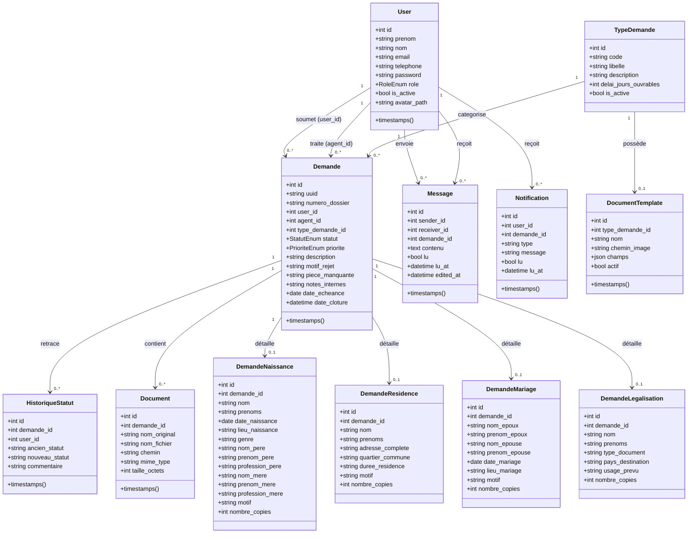
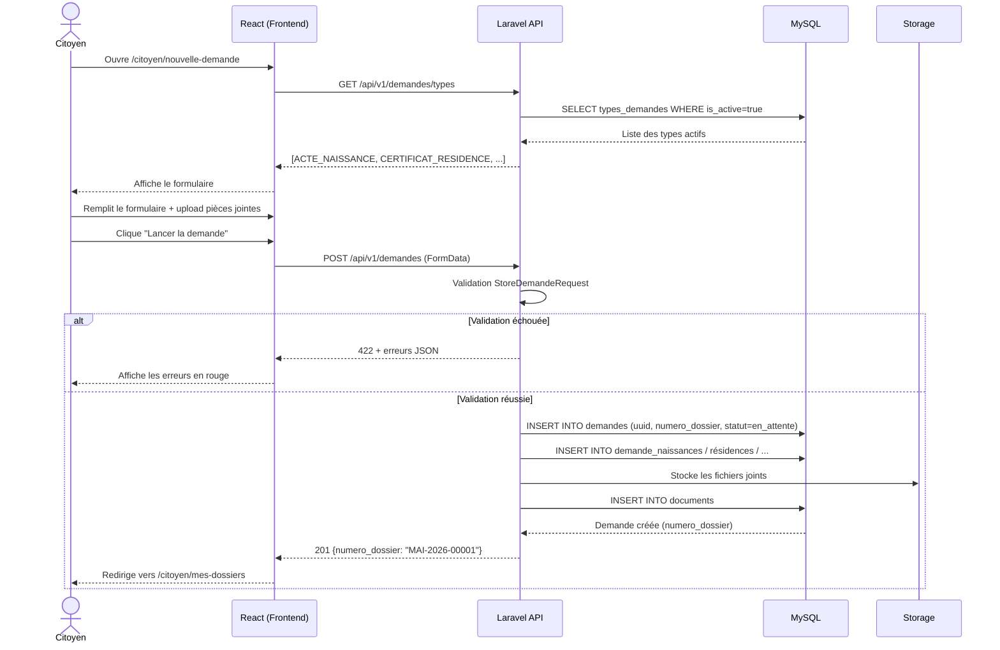
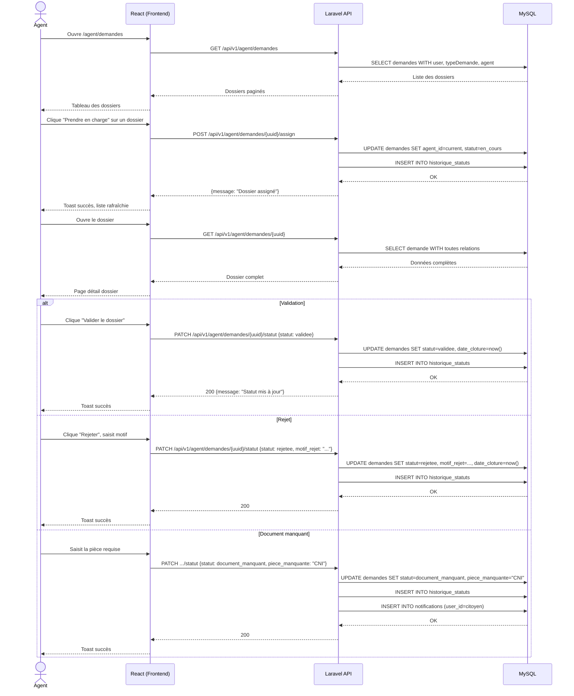
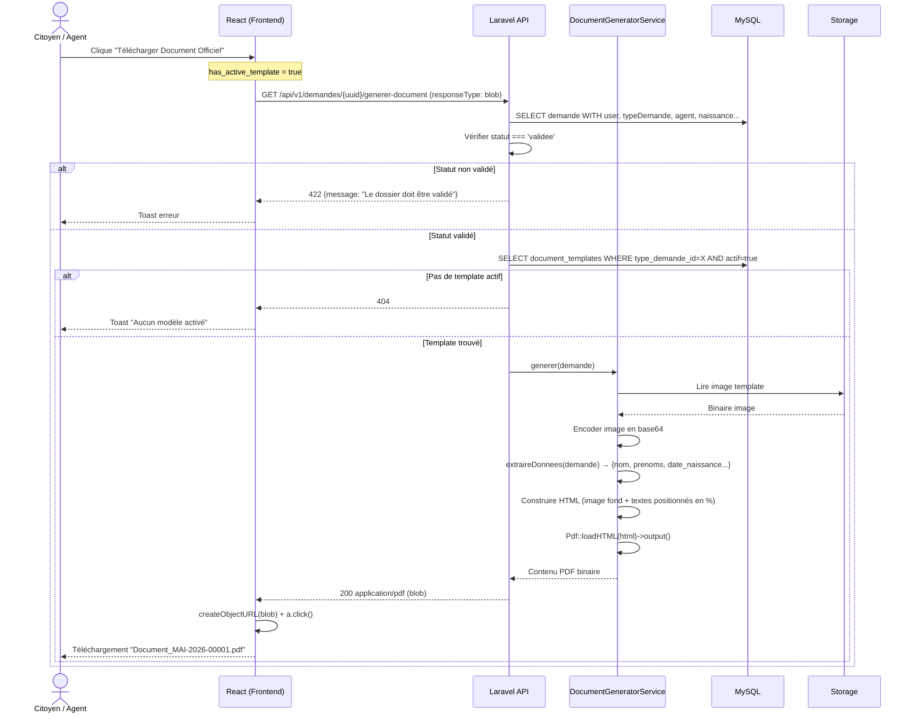
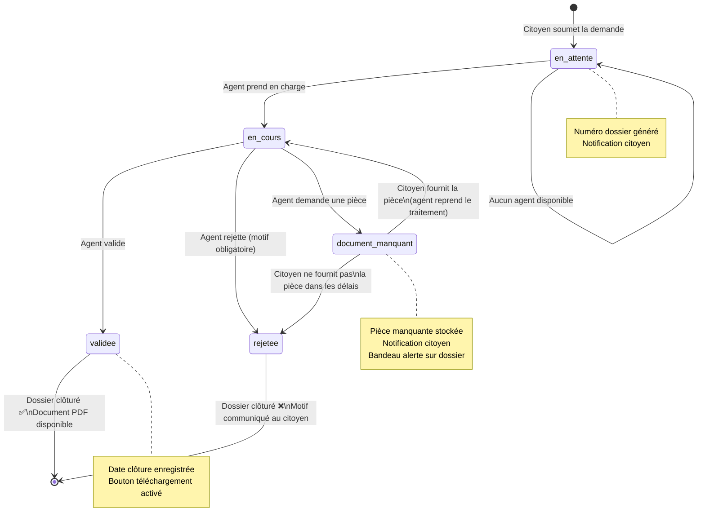

# Diagrammes UML
## Smart e-Mairie — Portail Numérique de la Mairie

---

**Version** : 1.0  
**Date** : Juin 2026  
**Outil** : Mermaid (rendu dans GitHub, Notion, VS Code + extension)

---

## 1. Diagramme de Cas d'Utilisation

```mermaid
graph TD
    Citoyen(["👤 Citoyen"])
    Agent(["👷 Agent"])
    Admin(["🛡️ Administrateur"])

    subgraph "Authentification"
        UC1[S'inscrire]
        UC2[Se connecter]
        UC3[Réinitialiser mot de passe]
        UC4[Gérer son profil]
    end

    subgraph "Espace Citoyen"
        UC5[Soumettre une demande]
        UC6[Suivre ses dossiers]
        UC7[Consulter un dossier]
        UC8[Télécharger document officiel]
        UC9[Envoyer un message à l'agent]
    end

    subgraph "Espace Agent"
        UC10[Voir tous les dossiers]
        UC11[Prendre en charge un dossier]
        UC12[Valider un dossier]
        UC13[Rejeter un dossier]
        UC14[Demander pièce manquante]
        UC15[Ajouter note interne]
        UC16[Répondre aux messages]
        UC17[Générer document PDF]
    end

    subgraph "Espace Administrateur"
        UC18[Voir tableau de bord stats]
        UC19[Gérer les utilisateurs]
        UC20[Gérer modèles documents]
        UC21[Configurer paramètres système]
        UC22[Exporter données]
        UC23[Consulter tous les dossiers]
    end

    Citoyen --> UC1
    Citoyen --> UC2
    Citoyen --> UC3
    Citoyen --> UC4
    Citoyen --> UC5
    Citoyen --> UC6
    Citoyen --> UC7
    Citoyen --> UC8
    Citoyen --> UC9

    Agent --> UC2
    Agent --> UC4
    Agent --> UC10
    Agent --> UC11
    Agent --> UC12
    Agent --> UC13
    Agent --> UC14
    Agent --> UC15
    Agent --> UC16
    Agent --> UC17

    Admin --> UC2
    Admin --> UC18
    Admin --> UC19
    Admin --> UC20
    Admin --> UC21
    Admin --> UC22
    Admin --> UC23
    Admin --> UC10
    Admin --> UC11
    Admin --> UC12
    Admin --> UC13
```



---

## 2. Diagramme de Classes



---

## 3. Diagramme de Séquence — Soumission d'une Demande



---

## 4. Diagramme de Séquence — Traitement d'un Dossier par l'Agent



---

## 5. Diagramme de Séquence — Génération du Document PDF



---

## 6. Diagramme d'Activité — Cycle de Vie d'un Dossier



---

## 7. Modèle Conceptuel de Données (MCD)

```mermaid
erDiagram
    USERS {
        int id PK
        string prenom
        string nom
        string email UK
        string telephone
        enum role "citoyen|agent|administrateur"
        bool is_active
    }

    TYPES_DEMANDES {
        int id PK
        string code UK
        string libelle
        int delai_jours_ouvrables
        bool is_active
    }

    DEMANDES {
        int id PK
        string uuid UK
        string numero_dossier UK
        int user_id FK
        int agent_id FK
        int type_demande_id FK
        enum statut
        enum priorite
        string piece_manquante
        string motif_rejet
        datetime date_cloture
    }

    HISTORIQUE_STATUTS {
        int id PK
        int demande_id FK
        int user_id FK
        string ancien_statut
        string nouveau_statut
        text commentaire
        datetime created_at
    }

    DOCUMENTS {
        int id PK
        int demande_id FK
        string nom_original
        string chemin
        string mime_type
        int taille_octets
    }

    MESSAGES {
        int id PK
        int sender_id FK
        int receiver_id FK
        int demande_id FK
        text contenu
        bool lu
        datetime lu_at
    }

    NOTIFICATIONS {
        int id PK
        int user_id FK
        int demande_id FK
        string type
        string message
        bool lu
    }

    DOCUMENT_TEMPLATES {
        int id PK
        int type_demande_id FK UK
        string nom
        string chemin_image
        json champs
        bool actif
    }

    DEMANDE_NAISSANCES {
        int id PK
        int demande_id FK UK
        string nom
        string prenoms
        date date_naissance
        string lieu_naissance
        string genre
        string nom_pere
        string nom_mere
    }

    DEMANDE_RESIDENCES {
        int id PK
        int demande_id FK UK
        string nom
        string adresse_complete
        string quartier_commune
        string duree_residence
    }

    DEMANDE_MARIAGES {
        int id PK
        int demande_id FK UK
        string nom_epoux
        string nom_epouse
        date date_mariage
        string lieu_mariage
    }

    DEMANDE_LEGALISATIONS {
        int id PK
        int demande_id FK UK
        string nom
        string type_document
        string pays_destination
    }

    USERS ||--o{ DEMANDES : "soumet"
    USERS ||--o{ DEMANDES : "traite"
    TYPES_DEMANDES ||--o{ DEMANDES : "catégorise"
    TYPES_DEMANDES ||--o| DOCUMENT_TEMPLATES : "possède"
    DEMANDES ||--o{ HISTORIQUE_STATUTS : "retrace"
    DEMANDES ||--o{ DOCUMENTS : "contient"
    DEMANDES ||--o{ NOTIFICATIONS : "génère"
    DEMANDES ||--o| DEMANDE_NAISSANCES : "détaille"
    DEMANDES ||--o| DEMANDE_RESIDENCES : "détaille"
    DEMANDES ||--o| DEMANDE_MARIAGES : "détaille"
    DEMANDES ||--o| DEMANDE_LEGALISATIONS : "détaille"
    USERS ||--o{ MESSAGES : "envoie"
    USERS ||--o{ MESSAGES : "reçoit"
    USERS ||--o{ NOTIFICATIONS : "reçoit"
```

---

*Diagrammes générés avec Mermaid — Rendu disponible sur GitHub, Notion, draw.io (import), VS Code (extension Mermaid Preview)*
