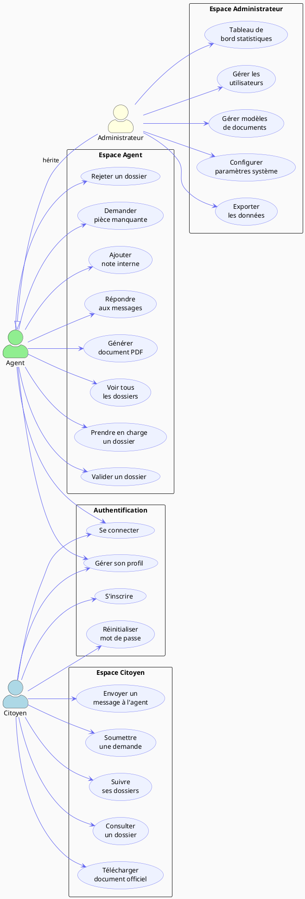
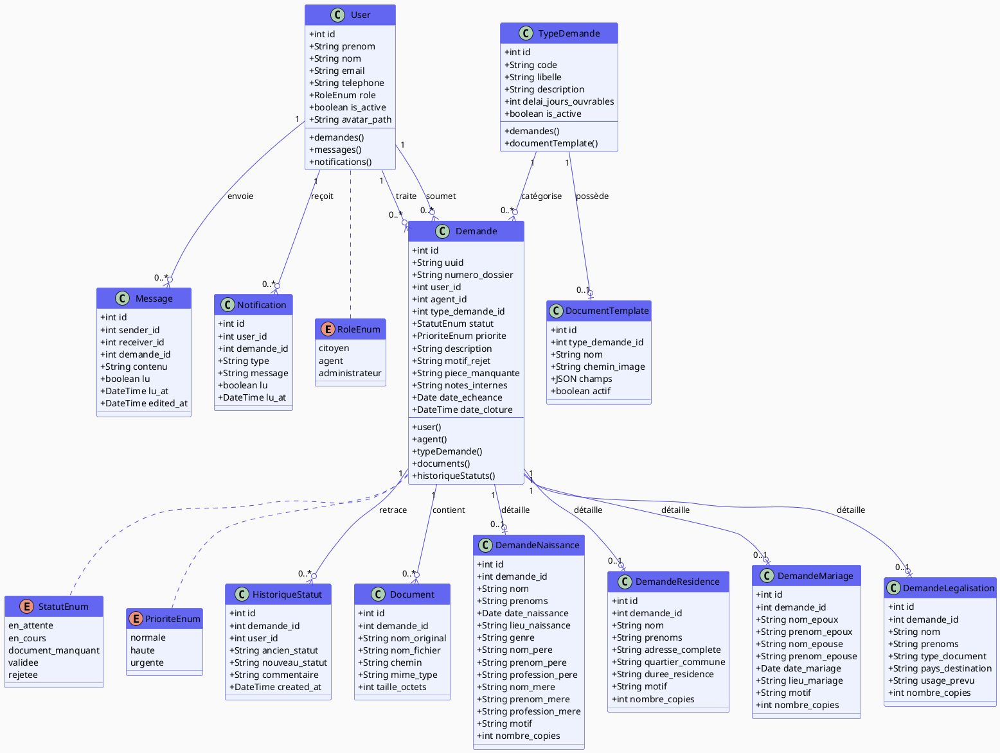
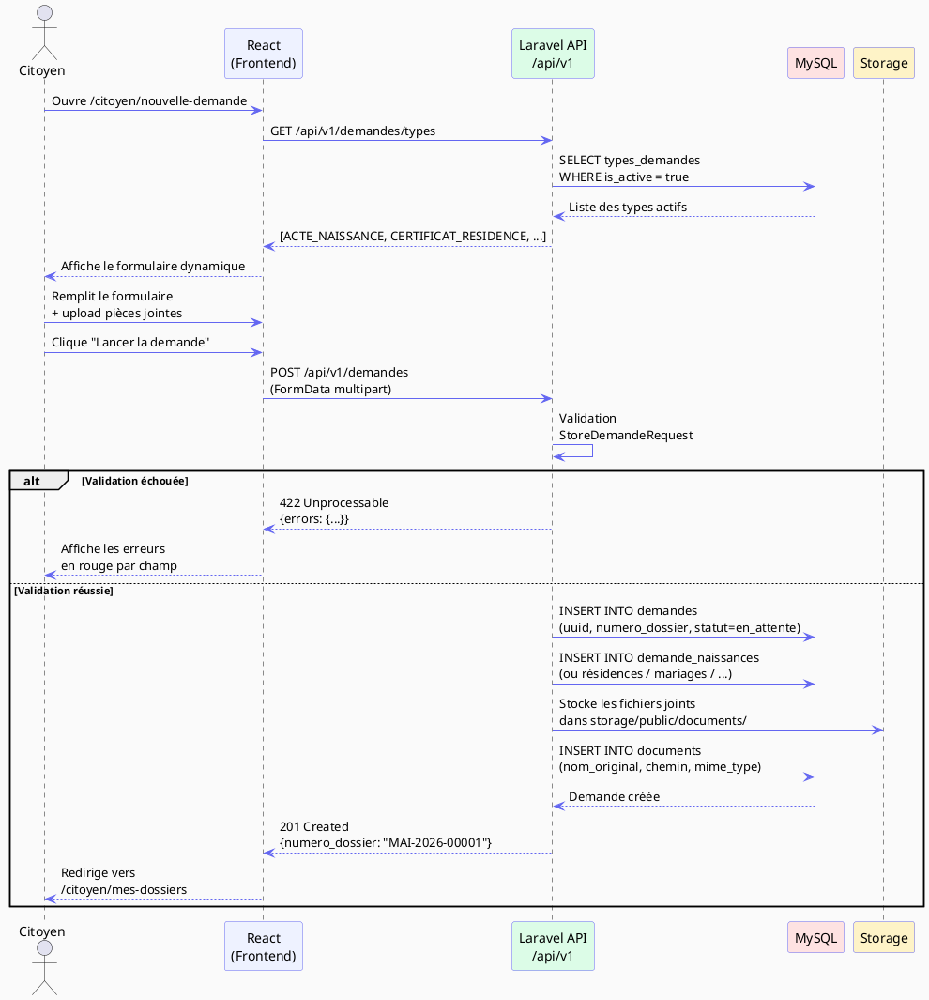
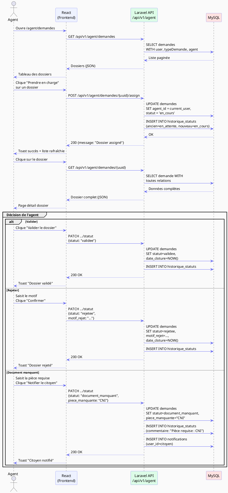
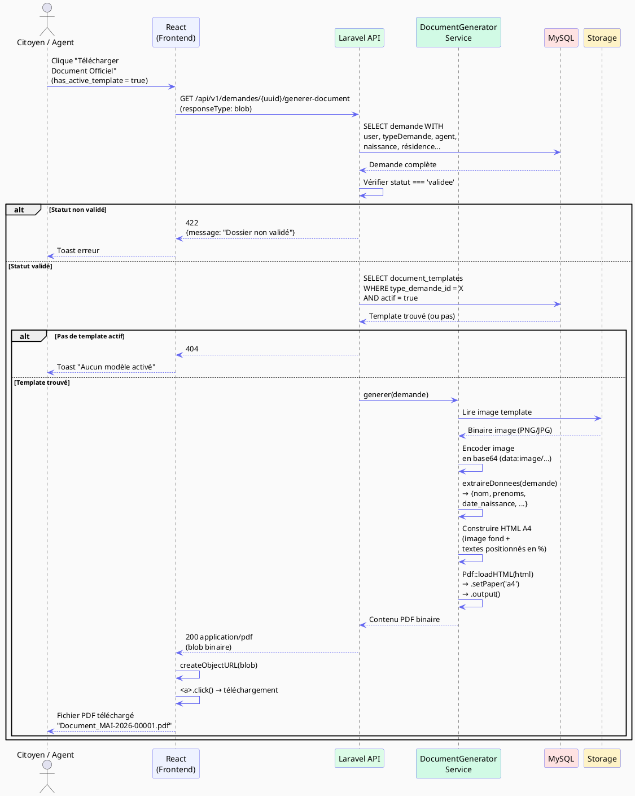
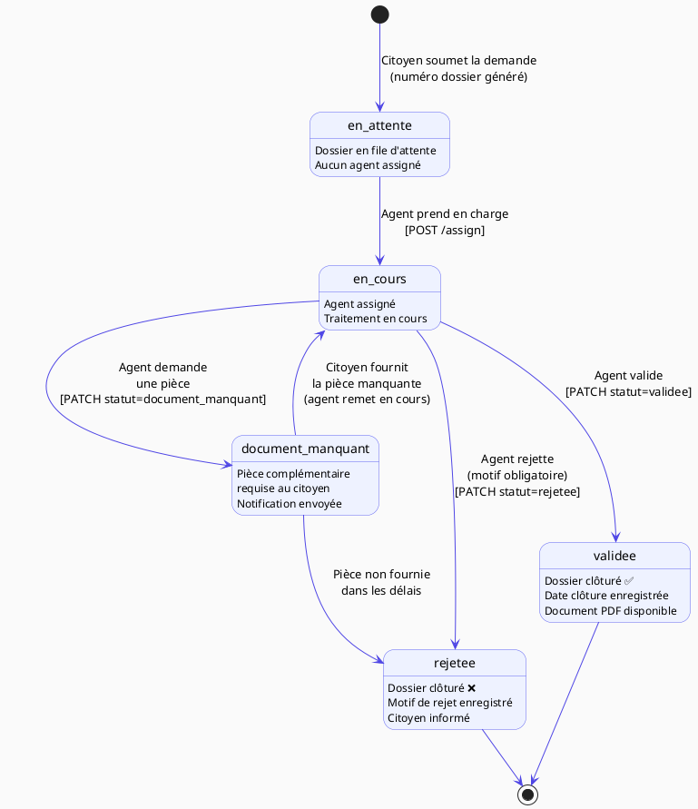
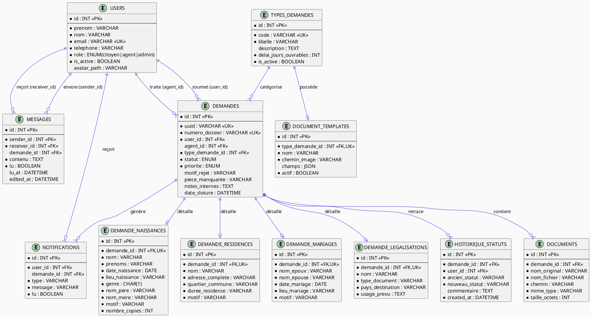

# Scripts PlantUML — Smart e-Mairie

Copiez chaque bloc `@startuml ... @enduml` dans PlantUML.

---

## 1. Diagramme de Cas d'Utilisation

---

## 2. Diagramme de Classes

---

## 3. Diagramme de Séquence — Soumission d'une Demande

---

## 4. Diagramme de Séquence — Traitement d'un Dossier (Agent)

---

## 5. Diagramme de Séquence — Génération du Document PDF

---

## 6. Diagramme d'État — Cycle de Vie d'un Dossier

---

## 7. Modèle Conceptuel de Données (MCD / ERD)

---

*Tous ces scripts sont compatibles avec PlantUML v1.2024+*
*Rendu en ligne : https://www.plantuml.com/plantuml/uml/*
